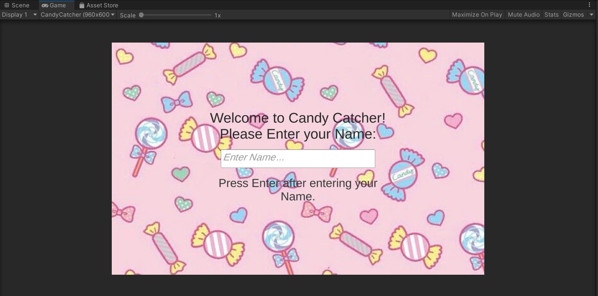
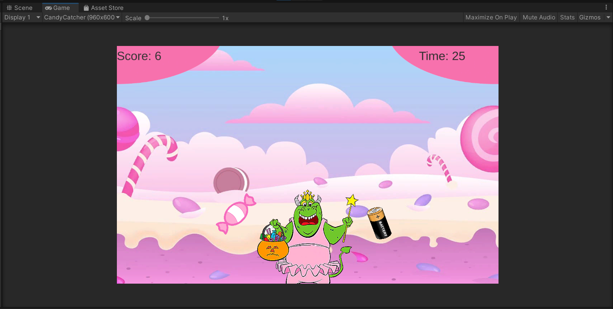
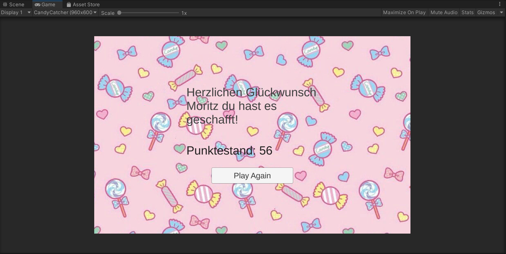

# 24CandyCatcher-mopvp

### Project description:
A rather Simple Candy Catcher Game for WebGL, that has a Menu-, Game- & Resultscene.

### Development platform:
Windows 10, Unity 2020 3.18f1, VisualStudio 2020

### Target platform:
WebGL 960x600

### Visuals:

### Third party material:
Thrash-Sprite: https://myloview.de/bild-abfall-tasche-cartoon-vektor-und-illustration-hand-gezeichnet-nr-5E692FE
Battery-Sprite: https://de.cleanpng.com/png-cffff4/
Candy-Sprite: https://www.pinterest.de/pin/91620173658753132/
Cupcake-Sprite: https://fastclipart.com/cupcake-images-clip-art-clipart-cute_87
Cookie-Sprite: https://de.123rf.com/photo_168154799_.html?vti=m69ng437gc32s6gmqi-1-81

Menu/Result-Background: https://www.pinterest.fr/pin/572942383820821474/?amp_client_id=CLIENT_ID(_)&mweb_unauth_id=%7B%7Bdefault.session%7D%7D&amp_url=https%3A%2F%2Fwww.pinterest.fr%2Famp%2Fpin%2F572942383820821474%2F
Game-Background: https://www.google.com/search?q=candy+cartoon+background&tbm=isch&ved=2ahUKEwij2bPrj8b1AhUh7rsIHT3gD3IQ2-cCegQIABAA&oq=candy+cartoon+background&gs_lcp=CgNpbWcQAzIECAAQEzIICAAQBxAeEBMyCAgAEAcQHhATMggIABAHEB4QEzIICAAQBRAeEBMyCAgAEAgQHhATMggIABAIEB4QEzIICAAQCBAeEBMyCAgAEAgQHhATMggIABAIEB4QEzoHCCMQ7wMQJzoGCAAQBxAeOggIABAHEAUQHjoICAAQCBAHEB5QogdYogdg1wloAHAAeACAAUKIAXySAQEymAEAoAEBqgELZ3dzLXdpei1pbWfAAQE&sclient=img&ei=Dl_sYaOaBqHc7_UPvcC_kAc&bih=739&biw=1519&client=firefox-b-d&hl=de#imgrc=w_ITgL9e7dWD-M

Player-Sprite: https://www.pngwing.com/de/free-png-bqhfq

### Project state:
100%

### Limitations:
Objects spawning to fast so they destroy themself bevor they can be collected. Needed help for some coding parts. 

### Lessons Learned:
How to spawn Prefabs randomly, using TextMeshPro & coding a game that stretches over multiple scene.

Copyright by Moritz Niedermeier aka mopvp
